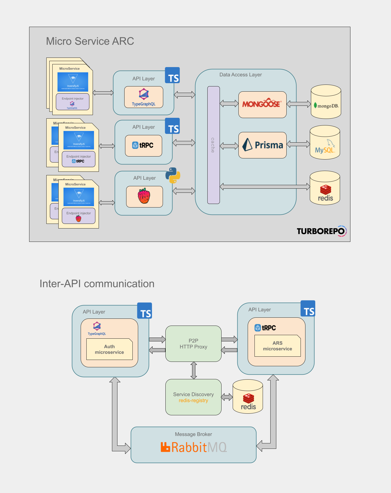

## saga-soa

### Introduction

Service Oriented Architecture for Saga Education

####

- Monorepo (turborepo)
- Introspectable, Schemaful APIs based on type-graphql, tRPC, REST
- ORM (TBD)
- Logcially composible micro-services
- Serverless | Server deployment

### Architecture

